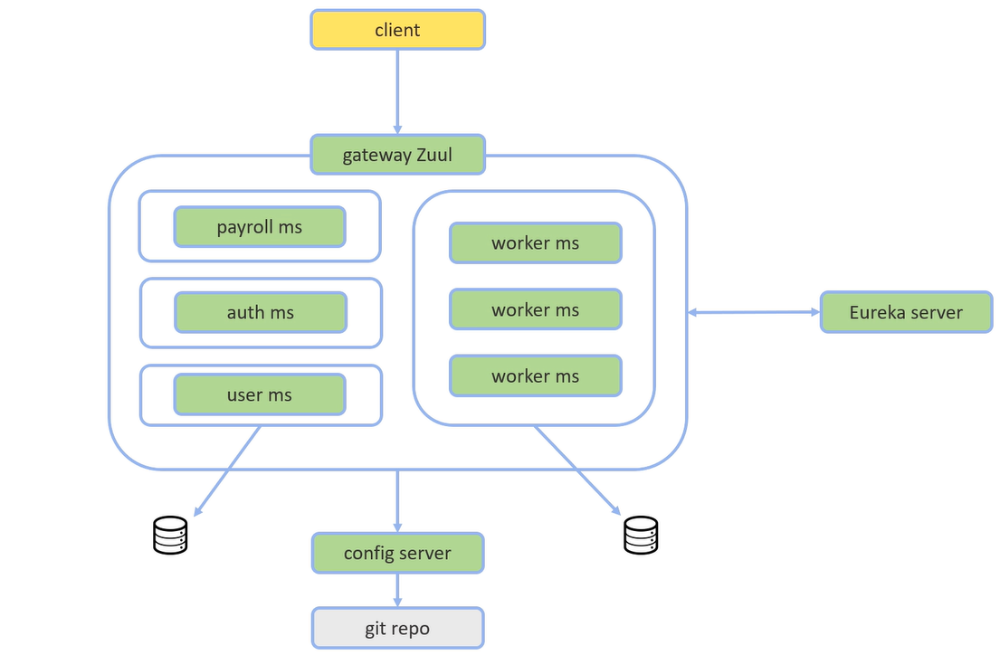

# Microsserviços Java com Spring Boot e Spring Cloud
Esta aplicação é um microsserviço de sistema de pagamento utilizando as seguintes tecnologias: Spring Cloud, Feign, Ribbon, Hystrix, OAuth, JWT, Discovery Server Eureka, 
API Gateway Zuul e Config Server.

O sistema desenvolvido possui 7 microsserviços: microsserviço de pagamento, microsserviço de usuário, microsserviço de autenticação de usuário, microsserviço para o 
servidor de configuração, microsserviço para o API Gateway Zull e o microsserviço Eureka.

## Arquitetura do Microsserviço

